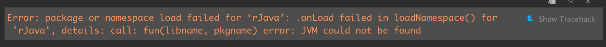
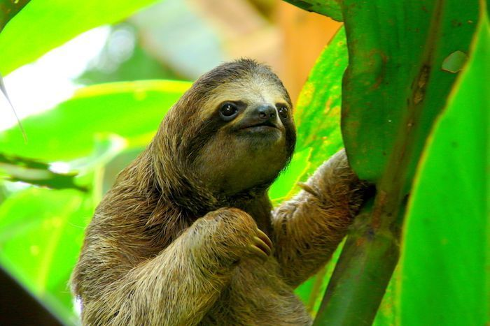

```{r setup, include=F}
knitr::opts_chunk$set(echo = T)
```

# Learning Objectives {-}

- Explore
  - Fetch species observations from the Global Biodiversity Information Facility (GBIF.org) using an R package that wraps a function around their API.
  - Fetch environmental data for defining environmental relationship in the species distribution model (SDM).
  - Generate pseudo-absences, or background, points with which to differentiate from the species presence points in the SDM.
  - Extract underlying environmental data from points.
  - Plot term plots of each environmental predictor with the species response.

# Overview

This lab will introduce you to machine learning by predicting presence of a species of you choosing from observations and environmental data. We will largely follow guidance found at [Species distribution modeling | R Spatial ](https://rspatial.org/raster/sdm/) using slightly newer R packages and functions.

# Explore

This first part of the lab involves fetching data for your species of interest, whether terrestrial or marine.


## Install Packages

You'll need to have the following R Software installed:

- [R](https://cran.r-project.org)
- [RStudio](https://www.rstudio.com/products/rstudio/download/#download)

You're also encouraged to use [git](https://git-scm.com/downloads) to version your code, ideally in a [Github](https://github.com) repository.

You'll use the [`librarian::shelf()`](https://cran.r-project.org/web/packages/librarian/vignettes/intro-to-librarian.html) function to load required software packages, installing them if needed.

```{r packages vars}
# load packages, installing if missing
if (!require(librarian)){
  install.packages("librarian")
  library(librarian)
}
librarian::shelf(
  dismo, dplyr, DT, ggplot2, here, htmltools, leaflet, mapview, purrr, raster, readr, rgbif, rgdal, rJava, sdmpredictors, sf, spocc, tidyr)
select <- dplyr::select # overwrite raster::select
options(readr.show_col_types = FALSE)

# set random seed for reproducibility
set.seed(42)

# directory to store data
dir_data <- here("data/sdm")
dir.create(dir_data, showWarnings = F)
```

If you have a problem installing the `rJava` package like so:

  

Please install the Java Virtual Machine (JVM) for your operating system by visiting these links:

- [rJava - Troubleshooting](https://github.com/s-u/rJava#troubleshooting)
- [Oracle Java Dev Kit Download](https://www.oracle.com/java/technologies/downloads/)
- [rJava fails to load · Issue #2254 · rstudio/rstudio](https://github.com/rstudio/rstudio/issues/2254#issuecomment-418830716)
- If on MacOS or Linux, be sure to run `sudo R CMD javareconf` from the Terminal, then restart your computer and try in the R Console `librarian::shelf(rJava)`.

If you're on a new Mac with the M1 processor, you might need to install the latest ARM 64-bit dmg for macOS from [Azul Downloads](https://www.azul.com/downloads/?package=jdk) (e.g. [zulu17.30.15-ca-jdk17.0.1-macosx_aarch64.dmg](https://cdn.azul.com/zulu/bin/zulu17.30.15-ca-jdk17.0.1-macosx_aarch64.dmg)).

## Choose a Species

Please enter your species of choice for this lab here:

* [Lab 1. Choose Species](
https://forms.gle/uer6qwTjB3uS56yh6) Google Form

Be sure to check nobody already chose this species here:

* [Lab 1. Choose Species (Responses)](https://docs.google.com/spreadsheets/d/1GQsLzo2q2zwu-86RTdBYk6ekcbzMOi1PU35MWghCBsY/edit?resourcekey#gid=454637140) Google Sheet

I also highly recommend choosing a species with at least 100 occurrences (try code below first). You can edit your choice through the form.

## Get Species Observations

For illustrative purposes, I'll choose the Brown-throated sloth (_Bradypus variegatus_) since we're going to start slow with Machine Learning.



```{r get obs}
obs_csv <- file.path(dir_data, "obs.csv")
obs_geo <- file.path(dir_data, "obs.geojson")
redo    <- FALSE

if (!file.exists(obs_geo) | redo){
  # get species occurrence data from GBIF with coordinates
  (res <- spocc::occ(
    query = 'Bradypus variegatus', 
    from = 'gbif', has_coords = T))
  
  # extract data frame from result
  df <- res$gbif$data[[1]] 
  readr::write_csv(df, obs_csv)
  
  # convert to points of observation from lon/lat columns in data frame
  obs <- df %>% 
    sf::st_as_sf(
      coords = c("longitude", "latitude"),
      crs = st_crs(4326)) %>% 
    select(prov, key) # save space (joinable from obs_csv)
  sf::write_sf(obs, obs_geo, delete_dsn=T)
}
obs <- sf::read_sf(obs_geo)
nrow(obs) # number of rows

# show points on map
mapview::mapview(obs, map.types = "Stamen.Terrain")
```

- **Code Tweak 1**. Swap your own species name, ie not `"Bradypus variegatus"`.

- **Code Tweak 2**. Update your `occ()` function to return a maximum of 10,000 records. (Hint: `?occ`)

- **Code Tweak 3**. Swap out the base map with a different basemap provider other than `Stamen.Terrain`. View various options for [leaflet-providers](http://leaflet-extras.github.io/leaflet-providers/preview/). 

- **Question 1**. How many observations total are in GBIF for your species? (Hint: `?occ`)

- **Question 2**.  Do you see any odd observations, like marine species on land or vice versa? If so, please see the [Data Cleaning](
https://rspatial.org/raster/sdm/2_sdm_occdata.html#data-cleaning) and explain what you did to fix or remove these points.

<!-- 
- **Question X**. Use the ‘rasterize’ function to create a raster of the number of observations and make a map. Use “wrld_simpl” from the maptools package for country boundaries.

- **Question X**. Map the uncertainty associated with the georeferences. Some records in data returned by gbif have that. You can also extract it from the data returned by the geocode function.
-->

## Get Environmental Data

Next, you'll use the Species Distribution Model predictors R package `sdmpredictors` to get underlying environmental data for your observations. First you'll get underlying environmental data for predicting the niche on the species observations. Then you'll generate pseudo-absence points with which to sample the environment. The model will differentiate the environment of the presence points from the pseudo-absence points.

### Presence

```{r get env}
dir_env <- file.path(dir_data, "env")

# set a default data directory
options(sdmpredictors_datadir = dir_env)

# choosing terrestrial
env_datasets <- sdmpredictors::list_datasets(terrestrial = TRUE, marine = FALSE)

# show table of datasets
env_datasets %>% 
  select(dataset_code, description, citation) %>% 
  DT::datatable()

# choose datasets for a vector
env_datasets_vec <- c("WorldClim", "ENVIREM")

# get layers
env_layers <- sdmpredictors::list_layers(env_datasets_vec)
DT::datatable(env_layers)

# choose layers after some inspection and perhaps consulting literature
env_layers_vec <- c("WC_alt", "WC_bio1", "WC_bio2", "ER_tri", "ER_topoWet")

# get layers
env_stack <- load_layers(env_layers_vec)

# interactive plot layers, hiding all but first (select others)
# mapview(env_stack, hide = T) # makes the html too big for Github
plot(env_stack, nc=2)
```

Notice how the extent is currently global for the layers. Let's crop the environmental rasters to a reasonable study area around our species observations.

```{r clip env_raster}
obs_hull_geo  <- file.path(dir_data, "obs_hull.geojson")
env_stack_grd <- file.path(dir_data, "env_stack.grd")

if (!file.exists(obs_hull_geo) | redo){
  # make convex hull around points of observation
  obs_hull <- sf::st_convex_hull(st_union(obs))
  
  # save obs hull
  write_sf(obs_hull, obs_hull_geo)
}
obs_hull <- read_sf(obs_hull_geo)

# show points on map
mapview(
  list(obs, obs_hull))

if (!file.exists(env_stack_grd) | redo){
  obs_hull_sp <- sf::as_Spatial(obs_hull)
  env_stack <- raster::mask(env_stack, obs_hull_sp) %>% 
    raster::crop(extent(obs_hull_sp))
  writeRaster(env_stack, env_stack_grd, overwrite=T)  
}
env_stack <- stack(env_stack_grd)

# show map
# mapview(obs) + 
#   mapview(env_stack, hide = T) # makes html too big for Github
plot(env_stack, nc=2)
```

### Pseudo-Absence

```{r make absence pts}
absence_geo <- file.path(dir_data, "absence.geojson")
pts_geo     <- file.path(dir_data, "pts.geojson")
pts_env_csv <- file.path(dir_data, "pts_env.csv")

if (!file.exists(absence_geo) | redo){
  # get raster count of observations
  r_obs <- rasterize(
    sf::as_Spatial(obs), env_stack[[1]], field=1, fun='count')
  
  # show map
  # mapview(obs) + 
  #   mapview(r_obs)
  
  # create mask for 
  r_mask <- mask(env_stack[[1]] > -Inf, r_obs, inverse=T)
  
  # generate random points inside mask
  absence <- dismo::randomPoints(r_mask, nrow(obs)) %>% 
    as_tibble() %>% 
    st_as_sf(coords = c("x", "y"), crs = 4326)
  
  write_sf(absence, absence_geo, delete_dsn=T)
}
absence <- read_sf(absence_geo)

# show map of presence, ie obs, and absence
mapview(obs, col.regions = "green") + 
  mapview(absence, col.regions = "gray")

if (!file.exists(pts_env_csv) | redo){

  # combine presence and absence into single set of labeled points 
  pts <- rbind(
    obs %>% 
      mutate(
        present = 1) %>% 
      select(present, key),
    absence %>% 
      mutate(
        present = 0,
        key     = NA)) %>% 
    mutate(
      ID = 1:n()) %>% 
    relocate(ID)
  write_sf(pts, pts_geo, delete_dsn=T)

  # extract raster values for points
  pts_env <- raster::extract(env_stack, as_Spatial(pts), df=TRUE) %>% 
    tibble() %>% 
    # join present and geometry columns to raster value results for points
    left_join(
      pts %>% 
        select(ID, present),
      by = "ID") %>% 
    relocate(present, .after = ID) %>% 
    # extract lon, lat as single columns
    mutate(
      #present = factor(present),
      lon = st_coordinates(geometry)[,1],
      lat = st_coordinates(geometry)[,2]) %>% 
    select(-geometry)
  write_csv(pts_env, pts_env_csv)
}
pts_env <- read_csv(pts_env_csv)

pts_env %>% 
  # show first 10 presence, last 10 absence
  slice(c(1:10, (nrow(pts_env)-9):nrow(pts_env))) %>% 
  DT::datatable(
    rownames = F,
    options = list(
      dom = "t",
      pageLength = 20))
```

In the end this table is the **data** that feeds into our species distribution model (`y ~ X`), where:

- `y` is the `present` column with values of `1` (present) or `0` (absent)
- `X` is all other columns:  `r paste(setdiff(names(pts_env), c("present", "ID")), collapse = ", ")`

## Term Plots

In the vein of [exploratory data analyses](https://r4ds.had.co.nz/exploratory-data-analysis.html), before going into modeling let's look at the data. Specifically, let's look at how obviously differentiated is the presence versus absence for each predictor -- a more pronounced presence peak should make for a more confident model. A plot for a specific predictor and response is called a "term plot". In this case we'll look for predictors where the presence (present = `1`) occupies a distinct "niche" from the background absence points (present = `0`).

```{r plot terms}
pts_env %>% 
  select(-ID) %>% 
  mutate(
    present = factor(present)) %>% 
  pivot_longer(-present) %>% 
  ggplot() +
  geom_density(aes(x = value, fill = present)) + 
  scale_fill_manual(values = alpha(c("gray", "green"), 0.5)) +
  scale_x_continuous(expand=c(0,0)) +
  scale_y_continuous(expand=c(0,0)) +
  theme_bw() + 
  facet_wrap(~name, scales = "free") +
  theme(
    legend.position = c(1, 0),
    legend.justification = c(1, 0))
```

<!--

# Ensemble

Maybe zoon R package.

-->

