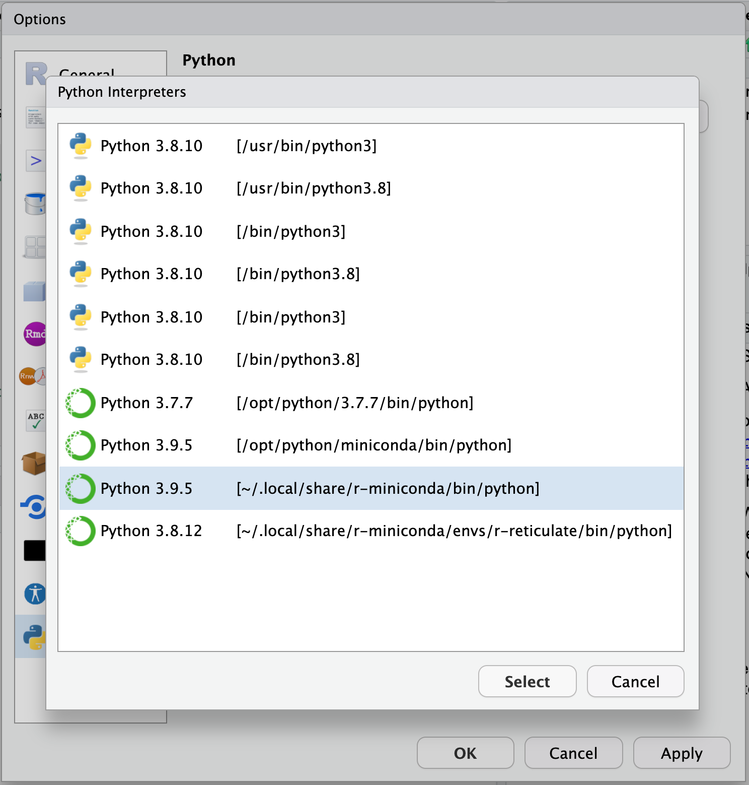
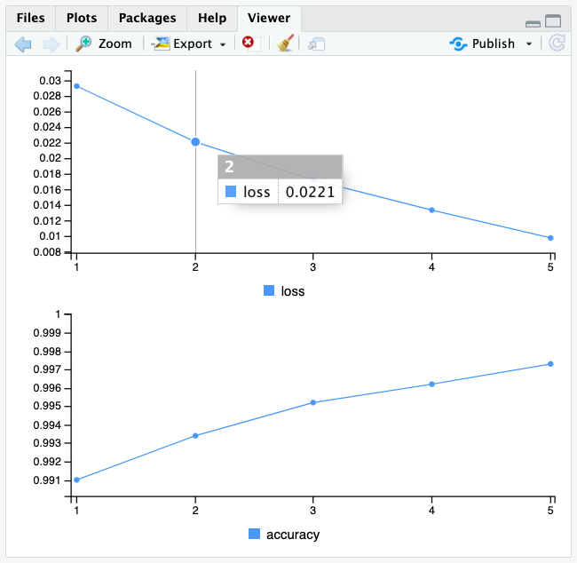

```{r setup, include=FALSE}
knitr::opts_chunk$set(echo = TRUE)
```

# Overview

In this lab, you'll become introduced to **Deep Learning** techniques that enable you to classify complex input data, such as imagery or sound. Eventually you'll use a subset of the dataset from [iNat Challenge 2021 - FGVC8 | Kaggle](https://www.kaggle.com/c/inaturalist-2021) to apply Deep Learning techniques to classify species from images. The cofounder of [iNaturalist](https://www.inaturalist.org/), [Scott Loarie](https://www.calacademy.org/patterson-scholar-scott-loarie), will also join our expert panel for the last class.

In this lab, you can _choose your own adventure_ by either doing it in **R** _**or**_ **Python** (or both if you so choose). Regardless, please use the server `taylor.bren.ucsb.edu`, which has all the necessary software installed. For R, you can continue using an RStudio Session and Rmarkdown document. For Python, it is recommended to use a JupyterLab Session and Python 3 (ipykernel) Notebook.

# Playing with Numbers (MNIST)

## R

### Install Python for R

```{r, results='hide'}
# load libraries
librarian::shelf(
  devtools,
  keras,
  reticulate,
  tensorflow)

# show library versions and paths
session_info() 

# install Python into user space
(reticulate::miniconda_path()) # show the Python path
if (!file.exists(reticulate::miniconda_path()))
  reticulate::install_miniconda()

# install keras with tensorflow
if (!keras::is_keras_available())
  keras::install_keras()
```

Next, tell RStudio to use this version of Python by default. Go to Tools > Global Options > Python and Select... to navigate to the option `~/.local/share/r-miniconda/bin/python`. You'll need to Apply and it should ask you to restart your session, which you'll need to accept.



***

This notebook contains the code samples found in Chapter 2, Section 1 of [Deep Learning with R](https://www.manning.com/books/deep-learning-with-r). Note that the original text features far more content, in particular further explanations and figures: in this notebook, you will only find source code and related comments.

***

Let's look at a concrete example of a neural network that uses the Keras R package to learn to classify hand-written digits. Unless you already have experience with Keras or similar libraries, you will not understand everything about this first example right away. You probably haven't even installed Keras yet. Don't worry, that is perfectly fine. In the next chapter, we will review each element in our example and explain them in detail. So don't worry if some steps seem arbitrary or look like magic to you! We've got to start somewhere.

The problem we're trying to solve here is to classify grayscale images of handwritten digits (28 pixels by 28 pixels) into their 10 categories (0 to 9). We'll use the MNIST dataset, a classic dataset in the machine-learning community, which has been around almost as long as the field itself and has been intensively studied. It's a set of 60,000 training images, plus 10,000 test images, assembled by the National Institute of Standards and Technology (the NIST in MNIST) in the 1980s. You can think of "solving" MNIST as the "Hello World" of deep learning—it's what you do to verify that your algorithms are working as expected. As you become a machine-learning practitioner, you'll see MNIST come up over and over again, in scientific papers, blog posts, and so on. 

The MNIST dataset comes preloaded in Keras, in the form of `train` and `test` lists, each of which includes a set of images (`x`) and associated labels (`y`):

### Listing 2.1 Loading the MNIST dataset in Keras

```{r}
library(keras)
mnist <- dataset_mnist()
```

_The R package reticulate interfaces with Python. When you pass tensorflow functions from R to Python on the server Taylor, you'll see  messages like below stating that you do not have the GPU setup, which refers the to the graphics processing unit or graphics card that speeds up computation of deep learning. That's fine, it will instead use the CPU (central processing unit)._

```
2022-02-09 03:47:25.915183: W tensorflow/stream_executor/platform/default/dso_loader.cc:64] Could not load dynamic library 'libcudart.so.11.0'; dlerror: libcudart.so.11.0: cannot open shared object file: No such file or directory; LD_LIBRARY_PATH: /opt/R/4.0.5/lib/R/lib::/lib:/usr/local/lib:/usr/lib/x86_64-linux-gnu:/usr/lib/jvm/java-11-openjdk-amd64/lib/server
2022-02-09 03:47:25.915213: I tensorflow/stream_executor/cuda/cudart_stub.cc:29] Ignore above cudart dlerror if you do not have a GPU set up on your machine.
Loaded Tensorflow version 2.7.1
```

```{r}
train_images <- mnist$train$x
train_labels <- mnist$train$y
test_images  <- mnist$test$x
test_labels  <- mnist$test$y
```

The `train_images` and `train_labels` form the _training set_, the data that the model will learn from. The model will then be tested on the  _test set_, `test_images` and `test_labels`. The images are encoded as 3D arrays, and the labels are a 1D array of digits, ranging from 0 to 9. There is a one-to-one correspondence between the images and the labels.

The R `str()` function is a convenient way to get a quick glimpse at the structure of an array. Let's use it to have a look at the training data:

```{r}
str(train_images)
```

```{r}
str(train_labels)
```

Let's have a look at the test data:

```{r}
str(test_images)
```

```{r}
str(test_labels)
```

The workflow will be as follows: first we'll feed the neural network the training data, `train_images` and `train_labels`. The network will then learn to associate images and labels. Finally, we'll ask the network to produce predictions for `test_images`, and we'll verify whether these predictions match the labels from `test_labels`.

Let's build the network -- again, remember that you aren't supposed to understand everything about this example yet.

### Listing 2.2 The network architecture

```{r}
network <- keras_model_sequential() %>% 
  layer_dense(units = 512, activation = "relu", input_shape = c(28 * 28)) %>% 
  layer_dense(units = 10, activation = "softmax")
```

_You may alternatively see messages about missing `cuda` or some `nvidia` driver doesn't exist. That again is because we only have a CPU and not GPU setup on Taylor. Nvidia is the GPU manufacturer who made the CUDA language to interface with the GPU that most dedicated deep learning systems use._

The core building block of neural networks is the _layer_, a data-processing module that you can think of as a filter for data. Some data comes in, and it comes out in a more useful form. Specifically, layers extract _representations_ out of the data fed into them—hopefully representations that are more meaningful for the problem at hand. Most of deep learning consists of chaining together simple layers that will implement a form of progressive _data distillation_. A deep-learning model is like a sieve for data processing, made of a succession of increasingly refined data filters—the layers.

Here our network consists of a sequence of two layers, which are densely connected (also called _fully connected_) neural layers. The second (and last) layer is a 10-way _softmax_ layer, which means it will return an array of 10 probability scores (summing to 1). Each score will be the probability that the current digit image belongs to one of our 10 digit classes.

To make the network ready for training, we need to pick three more things, as part of the _compilation_ step:

* _A loss function_—How the network will be able to measure how good a job it's doing on its training data, and thus how it will be able to steer itself in the right direction.
* _An optimizer_—The mechanism through which the network will update itself based on the data it sees and its loss function.
* _Metrics to monitor during training and testing_—Here we'll only care about accuracy (the fraction of the images that were correctly classified).

The exact purpose of the loss function and the optimizer will be made clear throughout the next two chapters.

### Listing 2.3 The compilation step

```{r}
network %>% compile(
  optimizer = "rmsprop",
  loss = "categorical_crossentropy",
  metrics = c("accuracy"))
```

Before training, we'll preprocess the data by reshaping it into the shape the network expects and scaling it so that all values are in the `[0, 1]` interval. Previously, our training images, for instance, were stored in an array of shape `(60000, 28, 28)` of type integer with values in the `[0, 255]` interval. We transform it into a double array of shape `(60000, 28 * 28)` with values between 0 and 1.

### Listing 2.4 Preparing the image data

```{r}
train_images <- array_reshape(train_images, c(60000, 28 * 28))
train_images <- train_images / 255
test_images  <- array_reshape(test_images, c(10000, 28 * 28))
test_images  <- test_images / 255
```

We also need to categorically encode the labels, a step which we explain in chapter 3:


### Listing 2.5 Preparing the labels

```{r}
train_labels <- to_categorical(train_labels)
test_labels  <- to_categorical(test_labels)
```

We are now ready to train our network, which in Keras is done via a call to the `fit` method of the network: we "fit" the model to its training data.

```{r, echo=TRUE, results='hide'}
network %>% fit(train_images, train_labels, epochs = 5, batch_size = 128)
```

Two quantities are being displayed during training: the "loss" of the network over the training data, and the accuracy of the network over the training data.

_Notice the Viewer pane plotted output in RStudio of **loss** and **accuracy**._



We quickly reach an accuracy of 0.989 (i.e. 98.9%) on the training data. Now let's check that our model performs well on the test set too:

```{r}
metrics <- network %>% evaluate(test_images, test_labels, verbose = 0)
metrics
```

Our test set accuracy turns out to be 98.1% -- that's quite a bit lower than the training set accuracy. This gap between training accuracy and test accuracy is an example of "overfitting", the fact that machine learning models tend to perform worse on new data than on their training data. Overfitting will be a central topic in chapter 3.

This concludes our first example -- you just saw how you can build and a train a neural network to classify handwritten digits in less than 20 lines of R code. In the next chapter, we'll go into detail about every moving piece we just previewed and clarify what's going on behind the scenes. You'll learn about tensors, the data-storing objects going into the network; about tensor operations, which layers are made of; and about gradient descent, which allows your network to learn from its training examples.

## Python

Visit [fchollet/deep-learning-with-python-notebooks at 8a30b90](https://github.com/fchollet/deep-learning-with-python-notebooks/tree/8a30b90fed187aaddaaf1fc868ec8e0ac92bca40), which is the author's repository of Python notebooks at the 2017 commit before switching to the second edition in 2021.

You can then download the first notebook, i.e. [2.1-a-first-look-at-a-neural-network.ipynb](https://github.com/fchollet/deep-learning-with-python-notebooks/raw/8a30b90fed187aaddaaf1fc868ec8e0ac92bca40/) by right-clicking to Save link as... locally, or perhaps if navigating from the Github folder similarly right-clicking on Raw to Save link as...

Then you can start a new JupyterLab Session and Python 3 (ipykernel) Notebook and upload the notebook file (`*.ipynb`) you previously downloaded.

