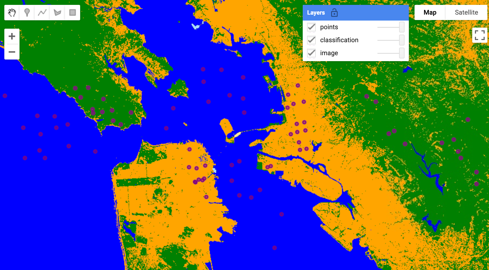
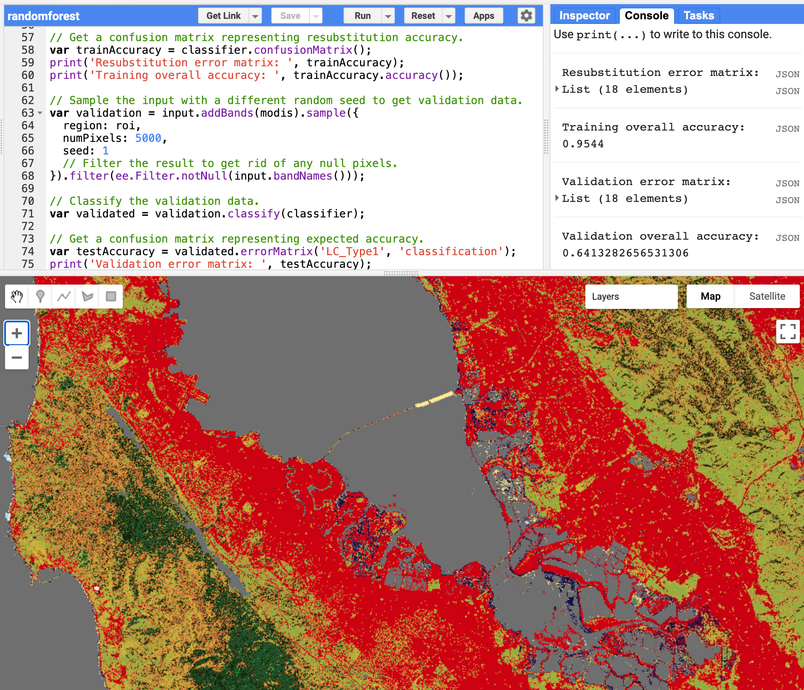

```{r setup, include=FALSE}
knitr::opts_chunk$set(echo = T)
```

# Learning Objectives {.unnumbered}

Google Earth Engine (GEE) is an online platform for spatial analytics with access to over 40 petabytes of data globally spanning over 30 years, largely composed of satellite imagery. Huge **storage** is combined with massive **computation** for the ultimate **cloud** solution. For instance, global climatologies spanning the satellite record of Landsat since 1984 (30m pixels covering the globe every 16 days) can be calculated and visualized instantly. You can also ***classify*** satellite images, e.g. into land cover or wetlands, using machine learning techniques. And it's free!

You will start using the native GEE Code Editor interface that uses **JavaScript**, which is by far the most common web-based programming language used on the front end (i.e., client web browser interactivity) and increasingly the back end (e.g., server Node JS using the React web framework).

Next week you will learn to run these techniques in a Google Colab notebook, a **Python** based variant of a Jupyter notebook hosted by Google.

It is possible to run **Deep Learning** models directly within GEE (see [TensorFlow example workflows \| GEE](https://developers.google.com/earth-engine/guides/tf_examples))) for more complex models, e.g. identifying ships or crops from satellite imagery, however that requires at least one of the following paid services that we haven't yet setup for class: Cloud Storage, AI Platform Prediction and/or AI Platform Training.

[**Today**]{.ul} you'll learn how to perform **Clustering** (***K-Means***) and **Decision Trees** (***CART*** and ***RandomForest***) on satellite imagery using Google Earth Engine.

# Google Earth Engine (GEE) Setup

A GEE account that is associated with a Google account, preferably your UCSB login, is required to log into the GEE Code Editor ([code.earthengine.google.com](https://code.earthengine.google.com)).

If you need a GEE account, please visit [signup.earthengine.google.com](https://signup.earthengine.google.com).

You may need to log out and back into your web browser as the preferred Google account to request permissions. This approval process usually takes a couple minutes.

Here are a couple of the fields I entered which you're welcome to use:

-   Affiliation/Institution\
    <https://bbest.github.io/eds232-ml/>

-   What would you like to accomplish with Earth Engine?\
    I will learn to apply machine learning to satellite imagery for both unsupervised (clustering) and supervised (RandomForest) learning.

# GEE Code Editor & JavaScript

The GEE documentation is quite good starting with [Get Started with Earth Engine \| GEE](https://developers.google.com/earth-engine/guides/getstarted), visiting [Introduction to JavaScript for Earth Engine \| GEE](https://developers.google.com/earth-engine/tutorials/tutorial_js_01) for a quick JavaScript refresher and going through the [Earth Engine Code Editor \| GEE](https://developers.google.com/earth-engine/guides/playground) if you're not yet familiar.

```{r fig.cap="Diagram of components of the Earth Engine Code Editor at [code.earthengine.google.com](code.earthengine.google.com). Source: [Earth Engine Code Editor](https://developers.google.com/earth-engine/guides/playground)", out.extra="class=external", echo=F}
knitr::include_graphics("https://developers.google.com/earth-engine/images/Code_editor_diagram.png")
```

# Unsupervised Classification - Clustering

We previously assigned clusters that minimize variation in observations across 2 variables, i.e. using `kmeans()` on the length and width of penguin bills ([Lab 2a. Community - Cluster](https://bbest.github.io/eds232-ml/lab2a_community-cluster.html#cluster-penguins-using-kmeans)). In this case, the variable space is the intensity of the different bands in the raster image (e.g. Red, Green, Blue). You similar input the number of clusters. Try out the following code from [Unsupervised Classification (clustering) \| GEE](https://developers.google.com/earth-engine/guides/clustering):

``` {.js}
// Load a pre-computed Landsat composite for input.
var input = ee.Image('LANDSAT/LE7_TOA_1YEAR/2001');

// Define a region in which to generate a sample of the input.
var region = ee.Geometry.Rectangle(29.7, 30, 32.5, 31.7);

// Display the sample region.
Map.setCenter(31.5, 31.0, 8);
Map.addLayer(ee.Image().paint(region, 0, 2), {}, 'region');

// Make the training dataset.
var training = input.sample({
  region: region,
  scale: 30,
  numPixels: 5000
});

// Instantiate the clusterer and train it.
var clusterer = ee.Clusterer.wekaKMeans(15).train(training);

// Cluster the input using the trained clusterer.
var result = input.cluster(clusterer);

// Display the clusters with random colors.
Map.addLayer(result.randomVisualizer(), {}, 'clusters');
```

Click **Run** and you should see the resulting `15` classes based on the training `region`.

```{r fig.cap="Map output from clustering, with 'clusters' layer opacity reduced.", layout="l-body", out.width = "100%", out.extra="class=external", echo=F}
knitr::include_graphics("img/lab5_gee/gee_clustering.png")
```

Now zoom out and notice how this classification is applied to LANDSAT globally!

Next, try changing the number of classes to `3`.

Next, try changing the `region` to a drawn region of interest (`roi`) that you will interactively create in the Map using the [**Geometry tools** - Earth Engine Code Editor \| GEE](https://developers.google.com/earth-engine/guides/playground?hl=en#geometry-tools) (visit this help for details). Start off by drawing a polygon on the coast that includes the ocean: `roi_coast`. Then try another one inland: `roi_inland`. You can swap out relevant lines above with the following to use the imported geometry.

``` {.js}
// Define a region in which to generate a sample of the input.
var region = roi_coast;

var ctr = region.centroid({'maxError': 1});
var ctr_lon = ee.Number(ctr.coordinates().get(0)).getInfo();
var ctr_lat = ee.Number(ctr.coordinates().get(1)).getInfo();

Map.setCenter(ctr_lon, ctr_lat, 8);
```

You can save scripts in the [**Script Manager (Scripts tab)** - Earth Engine Code Editor \| GEE](https://developers.google.com/earth-engine/guides/playground#script-manager-scripts-tab), e.g. `clustering`, `clustering_3`, `clustering_3coast`, and `clustering_3inland`.

For the lab, turn in the following:

1.  Image of original `clustering` for 15 classes in the original region of Egypt.

2.  Image of modified `clustering_3` for 3 classes in the original region of Egypt.

3.  Image of modified `clustering_3coast` for 3 classes in a new coastal region of your creation.

4.  Image of modified `clustering_3inland` for 3 classes in a new inland region of your creation.

5.  What do you notice about the differences between these classified outputs in qualitative terms?

# Supervised Classification - Decision Trees

Next, you'll apply a Supervised Learning technique, whereby we have a set of points in which we have identified the classes, like land cover type. You will start by using a classification and regression tree (CART; `smileCart()`), similar to how you applied `rpart()` in [Lab 1c. Species Distribution Modeling - Decision Trees](https://bbest.github.io/eds232-ml/lab1c_sdm-trees.html). In this case each point has a set of values corresponding to the bands in the image rather than a more explicit environmental value (e.g. from WorldClim). These values are extracted from the raster with the `sampleRegions()` function. Notice how the pattern from Lab 1 repeats with fitting (`smileCart().train()`) and predicting (`classify()`). The output `classified` raster image gets added to the map. Please run this first code chunk from [Unsupervised Classification (clustering) \| GEE](https://developers.google.com/earth-engine/guides/clustering) with an additional line to display the training points.

```{js}
// Define a function that scales and masks Landsat 8 surface reflectance images.
function prepSrL8(image) {
  // Develop masks for unwanted pixels (fill, cloud, cloud shadow).
  var qaMask = image.select('QA_PIXEL').bitwiseAnd(parseInt('11111', 2)).eq(0);
  var saturationMask = image.select('QA_RADSAT').eq(0);

  // Apply the scaling factors to the appropriate bands.
  var getFactorImg = function(factorNames) {
    var factorList = image.toDictionary().select(factorNames).values();
    return ee.Image.constant(factorList);
  };
  var scaleImg = getFactorImg([
    'REFLECTANCE_MULT_BAND_.|TEMPERATURE_MULT_BAND_ST_B10']);
  var offsetImg = getFactorImg([
    'REFLECTANCE_ADD_BAND_.|TEMPERATURE_ADD_BAND_ST_B10']);
  var scaled = image.select('SR_B.|ST_B10').multiply(scaleImg).add(offsetImg);

  // Replace original bands with scaled bands and apply masks.
  return image.addBands(scaled, null, true)
    .updateMask(qaMask).updateMask(saturationMask);
}

// Make a cloud-free Landsat 8 surface reflectance composite.
var image = ee.ImageCollection('LANDSAT/LC08/C02/T1_L2')
  .filterDate('2021-03-01', '2021-07-01')
  .map(prepSrL8)
  .median();

// Use these bands for prediction.
var bands = ['SR_B2', 'SR_B3', 'SR_B4', 'SR_B5',
             'SR_B6', 'SR_B7', 'ST_B10'];

// Load training points. The numeric property 'class' stores known labels.
var points = ee.FeatureCollection('GOOGLE/EE/DEMOS/demo_landcover_labels');

// This property stores the land cover labels as consecutive
// integers starting from zero.
var label = 'landcover';

// Overlay the points on the imagery to get training.
var training = image.select(bands).sampleRegions({
  collection: points,
  properties: [label],
  scale: 30
});

// Train a CART classifier with default parameters.
var trained = ee.Classifier.smileCart().train(training, label, bands);

// Classify the image with the same bands used for training.
var classified = image.select(bands).classify(trained);

// Display the inputs and the results.
Map.setCenter(-122.0877, 37.7880, 11);
Map.addLayer(image,
             {bands: ['SR_B4', 'SR_B3', 'SR_B2'], min: 0, max: 0.25},
             'image');
Map.addLayer(classified,
             {min: 0, max: 2, palette: ['orange', 'green', 'blue']},
             'classification');

// Add the training points to map
Map.addLayer(points, {color: 'purple'}, 'points');
```

```{r fig.cap="Decision tree model output from `smileCart()` with training points in purple.", layout="l-body", out.width = "100%", out.extra="class=external", echo=F}

```

In the third code chunk from [Unsupervised Classification (clustering) \| GEE](https://developers.google.com/earth-engine/guides/clustering) , a RandomForest model (`smileRandomForest()`) is evaluated for its performance (`confusionMatrix()`) based on how well the model predicts the original inputs.

```{js}
// Define a region of interest.
var roi = ee.Geometry.BBox(-122.93, 36.99, -121.20, 38.16);

// Define a function that scales and masks Landsat 8 surface reflectance images.
function prepSrL8(image) {
  // Develop masks for unwanted pixels (fill, cloud, cloud shadow).
  var qaMask = image.select('QA_PIXEL').bitwiseAnd(parseInt('11111', 2)).eq(0);
  var saturationMask = image.select('QA_RADSAT').eq(0);

  // Apply the scaling factors to the appropriate bands.
  var getFactorImg = function(factorNames) {
    var factorList = image.toDictionary().select(factorNames).values();
    return ee.Image.constant(factorList);
  };
  var scaleImg = getFactorImg([
    'REFLECTANCE_MULT_BAND_.|TEMPERATURE_MULT_BAND_ST_B10']);
  var offsetImg = getFactorImg([
    'REFLECTANCE_ADD_BAND_.|TEMPERATURE_ADD_BAND_ST_B10']);
  var scaled = image.select('SR_B.|ST_B10').multiply(scaleImg).add(offsetImg);

  // Replace original bands with scaled bands and apply masks.
  return image.addBands(scaled, null, true)
    .updateMask(qaMask).updateMask(saturationMask);
}

// Make a cloud-free Landsat 8 surface reflectance composite.
var input = ee.ImageCollection('LANDSAT/LC08/C02/T1_L2')
    .filterBounds(roi)
    .filterDate('2020-03-01', '2020-07-01')
    .map(prepSrL8)
    .median()
    .setDefaultProjection('EPSG:4326', null, 30)
    .select(['SR_B2', 'SR_B3', 'SR_B4', 'SR_B5', 'SR_B6', 'SR_B7']);

// Use MODIS land cover, IGBP classification, for training.
var modis = ee.Image('MODIS/006/MCD12Q1/2020_01_01')
    .select('LC_Type1');

// Sample the input imagery to get a FeatureCollection of training data.
var training = input.addBands(modis).sample({
  region: roi,
  numPixels: 5000,
  seed: 0
});

// Make a Random Forest classifier and train it.
var classifier = ee.Classifier.smileRandomForest(10)
    .train({
      features: training,
      classProperty: 'LC_Type1',
      inputProperties: ['SR_B2', 'SR_B3', 'SR_B4', 'SR_B5', 'SR_B6', 'SR_B7']
    });

// Classify the input imagery.
var classified = input.classify(classifier);

// Get a confusion matrix representing resubstitution accuracy.
var trainAccuracy = classifier.confusionMatrix();
print('Resubstitution error matrix: ', trainAccuracy);
print('Training overall accuracy: ', trainAccuracy.accuracy());

// Sample the input with a different random seed to get validation data.
var validation = input.addBands(modis).sample({
  region: roi,
  numPixels: 5000,
  seed: 1
  // Filter the result to get rid of any null pixels.
}).filter(ee.Filter.notNull(input.bandNames()));

// Classify the validation data.
var validated = validation.classify(classifier);

// Get a confusion matrix representing expected accuracy.
var testAccuracy = validated.errorMatrix('LC_Type1', 'classification');
print('Validation error matrix: ', testAccuracy);
print('Validation overall accuracy: ', testAccuracy.accuracy());

// Define a palette for the IGBP classification.
var igbpPalette = [
  'aec3d4', // water
  '152106', '225129', '369b47', '30eb5b', '387242', // forest
  '6a2325', 'c3aa69', 'b76031', 'd9903d', '91af40',  // shrub, grass
  '111149', // wetlands
  'cdb33b', // croplands
  'cc0013', // urban
  '33280d', // crop mosaic
  'd7cdcc', // snow and ice
  'f7e084', // barren
  '6f6f6f'  // tundra
];

// Display the input and the classification.
Map.centerObject(roi, 10);
Map.addLayer(input.clip(roi),
             {bands: ['SR_B4', 'SR_B3', 'SR_B2'], min: 0, max: 0.25},
             'landsat');
Map.addLayer(classified.clip(roi),
             {palette: igbpPalette, min: 0, max: 17},
             'classification');
```

Notice how the training and validation points are sampled from the MODIS land cover (`modis`) and how the outputs are printed in the Console.

```{r fig.cap="Code Editor showing evaluation code for a  RandomForest model and Console output of model performance with classified image in Map.", layout="l-body", out.width = "100%", out.extra="class=external", echo=F}

```


(Fun facts: the `smile` in `smileCart()` and `smileRandomForest()` comes from the Java library [Statistical Machine Intelligence and Learning Engine](https://haifengl.github.io/index.html) similar to how the `weka` in `wekaKMeans()` clustering comes from the Java library [Waikato Environment for Knowledge Analysis](https://www.cs.waikato.ac.nz/ml/weka/).)

Modify the following parameters above and report the changes in accuracy for training and validation:

1.  Change the `numberOfTrees` in [`smileRandomForest()`](https://developers.google.com/earth-engine/apidocs/ee-classifier-smilerandomforest) to a lesser and higher number.

2.  Change the `numPixels` in the training sample to a lesser and higher number.

3.  Qualitatively explain how these changes affect the two accuracy metrics.

# Going Further

GEE Tutorials:

-   [Google Earth Engine \| Software Carpentry style](https://geohackweek.github.io/GoogleEarthEngine/)
-   [Beginner's Cookbook \| GEE](https://developers.google.com/earth-engine/tutorials/community/beginners-cookbook?hl=en)
-   [Forest Change Analysis in Earth Engine \| GEE](https://developers.google.com/earth-engine/tutorials/tutorial_forest_01)
-   [Global Surface Water Analysis in Earth Engine \| GEE](https://developers.google.com/earth-engine/tutorials/tutorial_global_surface_water_01)

GEE & TensorFlow:

-   [TensorFlow and Earth Engine \| GEE](https://developers.google.com/earth-engine/guides/tensorflow)
-   [TensorFlow example workflows \| GEE](https://developers.google.com/earth-engine/guides/tf_examples)
-   [Integrating Earth Engine with Tensorflow I - DNN](https://csaybar.github.io/blog/2019/05/30/eetf/)
-   [Integrating Earth Engine with Tensorflow II - U-Net](https://csaybar.github.io/blog/2019/06/21/eetf2/)
